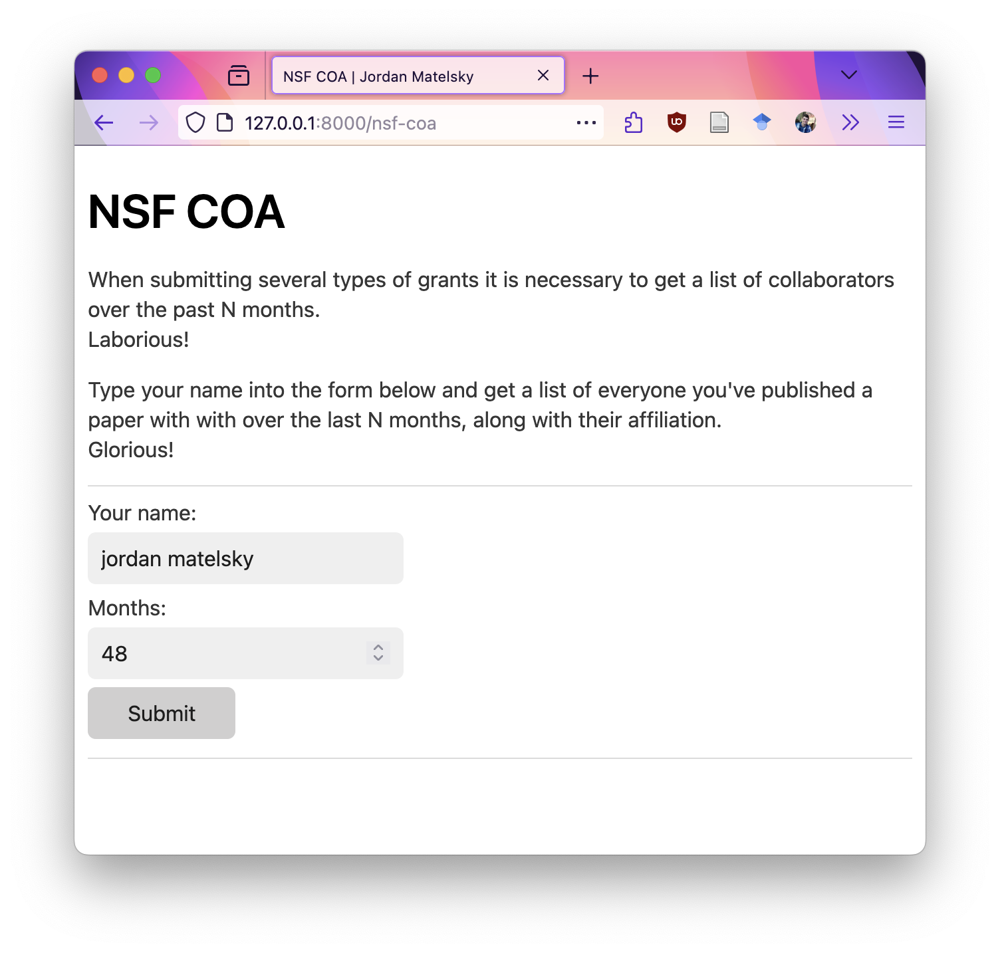
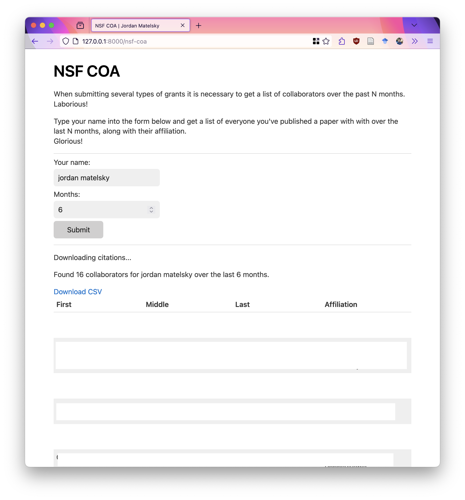

# NSF-COA App

The National Science Foundation (NSF) requires that all proposals include a Collaborators and Other Affiliations (COA) document. The COA document provides information on all collaborators (and their affiliations) for personnel who are involved in the project.

It's a real pain in the butt to collect this information.

This app rapidly generates a starting point for the COA document by pulling in collaborators from papers published in recent (by default, 48) months.

The app uses the [OpenAlex](https://openalex.org/) API to pull in collaborators from papers. OpenAlex is a free, open-source tool that provides a simple API to access academic publishing and affiliation data.

## Installation

This repository uses the [`uv`](https://docs.astral.sh/uv/) tool to manage the development environment. To install `uv`, run the following command:

```bash
curl -fsSL https://uv.astral.sh | bash
```

Then run a development server locally with uvicorn:

```bash
uv run uvicorn server:app --reload
```

Changes to the code will automatically reload the server.

## Usage



Put your name and the duration into the form and press the submit button.

You will get a table of collaborators and their affiliations:



You can also download the table as a CSV file by pressing the "**Download CSV**" link.
